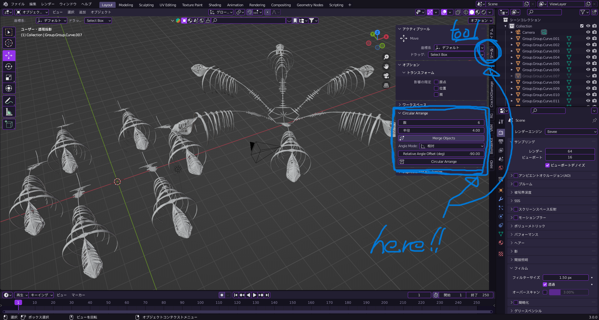

# Circular Arrange v1.2.1 – for Blender 2.8.0 and above

**Circular Arrange** is a Blender add-on that lets you arrange multiple copies of a selected object in a circular pattern by specifying the number of instances and the radius.  
Install `circular_arrange.py` via *Edit > Preferences > Add-ons*, then enable it using the checkbox.

## How to Use

1. **Select the object** you want to duplicate and arrange in a circle, then press the `N` key to open the right-hand toolbar.
2. In the toolbar, find **"Circular Arrange"**.  
   Set your desired **number of instances** and **radius**, then click the `Circular Arrange` button to apply.
3. Enable **Merge Objects** if you want to join all the arranged objects into a single one.

