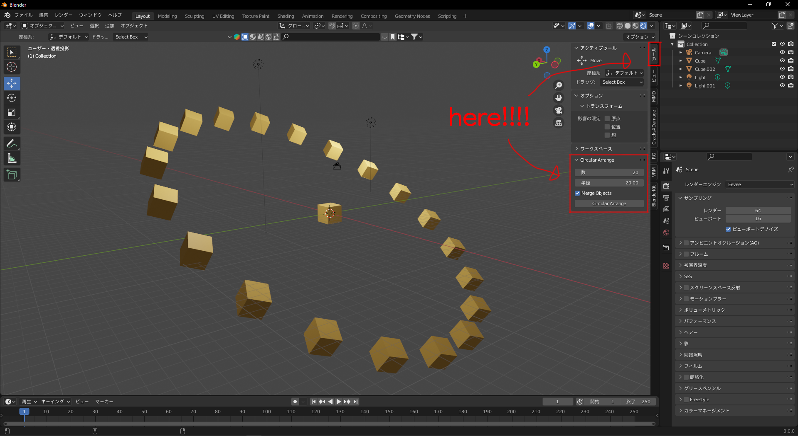

# Circular Arrange v1.3.0 / blender version 2.8.0 or higher
Circular Arrangeは、オブジェクトを選択し数と半径を指定して円形に配置できるアドオンです。`circular_arrange.py`をプリファレンスからインストールし、チェックボックスで有効化すると使えるようになります。

## English
📄 [Click here for the English README](./README-EN.md)

## 使い方

1. **複製・円形配置したいオブジェクトを選択**した状態で`n`キーを押し、ツールバーからツールを選択します。
2. ツールに`Circular Arrange`が表示されているので、**Count（数）**と**Radius（半径）**をお好みの数値に設定し、`Circular Arrange`をクリックするとオブジェクトが円形配置されます。
3. **Merge Objects**にチェックを入れると、円形配置されたオブジェクトを統合します。
4. **Angle Mode**で回転方法を選択できます。
    - **Relative**: 各オブジェクトが中心から外向きになるように回転します。
        - **Relative Angle Offset (deg)**: 追加で全体に回転オフセットを加えられます。
    - **Fixed**: 全てのオブジェクトが同じ角度で配置されます。
        - **Fixed Angle (deg)**: 固定する角度を指定します。

